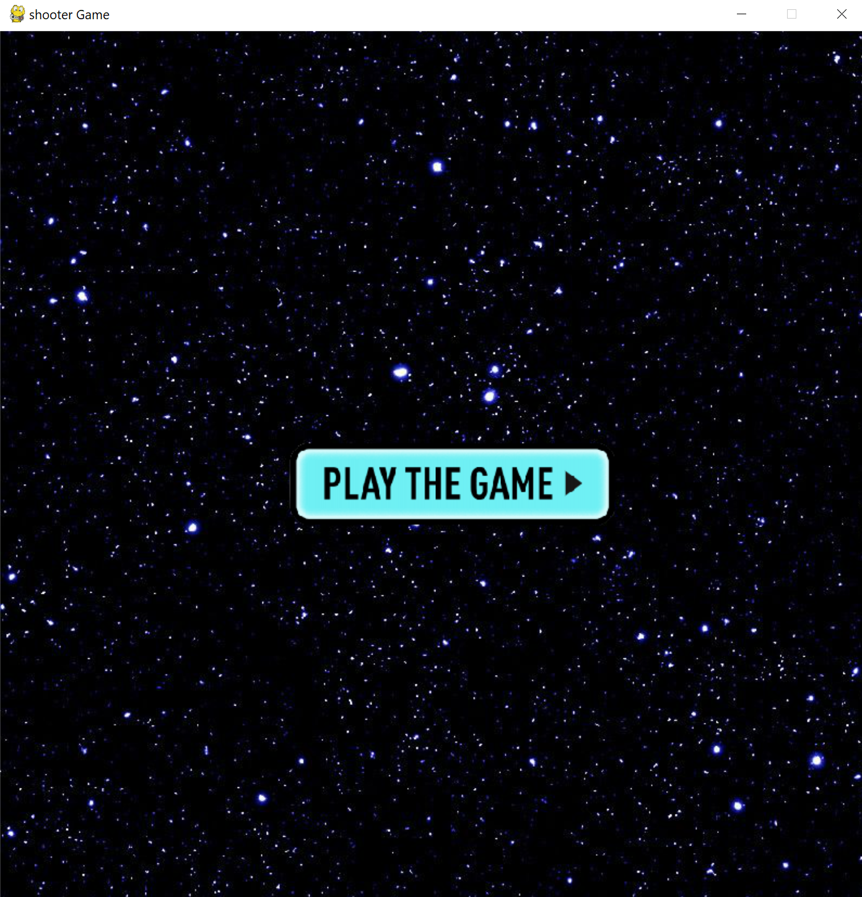
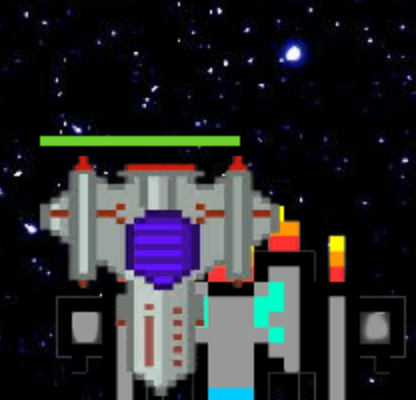
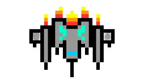
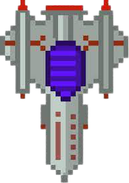
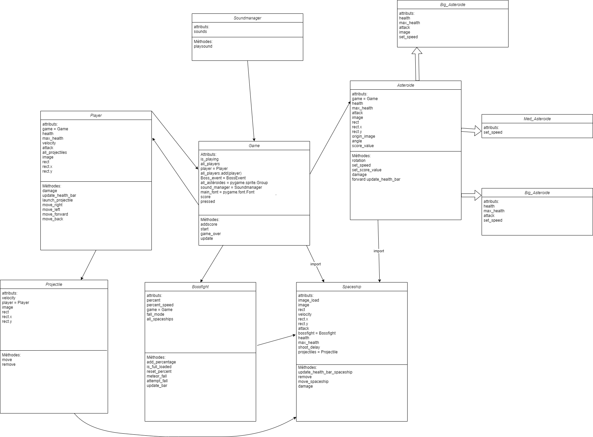

# Editor_pygame

### Note : notre jeu n'est pas actuellement terminé. Ce readme est temporaire, et présente le jeu dans son état actuel.

## Interface
Notre jeu détient les caractéristiques suivante:

- une interface menu au démarage du jeu
- un boutton pour initier une partie
- un module "mixer" qui permet la gestion des sonorités du jeu
- un score est affiché tout au long de la partie
- un système de tire de proprojectile
- des phases de jeu
- des classes mères, des superclasses et une structure de code synthétique qui comprend des héritages et des partages d'attributs

## Le menu

Voici l'interface du menu
* Au démarage, il y a un boutton play qui initie la partie
* Nous prévoyons d’ajouter un boutton settings pour des modifications immédiates des réglages audios (son + effets sonores, toggle)

## La partie

Une partie de notre jeu a deux phases distinctes:
- La phase des astéroïdes, au cours de laquelle il faut éviter et éliminer des astéroïdes qui tombent pour faire augmenter le score, qui constitue l'essentiel de la partie
- Une phase BossFight lorsque assez d'astéroïdes sont "tuées", au cours de laquelle deux vaisseaux ennemis, bien plus difficiles à battre, apparaitront et il faudra les affronter

Toutes deux sont activées lorsque qu’un certains nombre d’ennemis sont tués. Lorsque ce score est atteint, la phase suivante intervient.

## Les classes
#### * Game
- la classe Game est la colonne vertébrale du jeu. Elle initie la partie, et fait se fait instanciée dans d'autres classes en tant qu'attribut de celles-ci.

#### * Astéroide
- la classe astéroide est une classe mère. Elle partage ses méthodes et certains de ses attributs aux sous-classes qui héritent de celle-ci, notamment les sous classes d’astéroides de tailles différentes, telles que Med_Astéroide, Small_Astéroide et Big_Astéroide.
 
#### * BossFight
- Lorsque la barre de recharge est complète, la classe BossFight permet de déclencher un évennement de combat de boss, dans lequel deux objets de la classe Spaceship que le joueur devra affronter apparaîtront et les astéroïdes arrêteront de tomber. Lorsque le joueur sort victorieux de l'affront, les astéroïdes et la partie reprendront.

#### image de la phase BossFight

#### En parallèle, voici la phase astéroïdes:

#### * player
- gère le joueur, ses mouvements, sa vélocité

#### * SpaceshipEnnemi
- La classe qui permet de créer des vaisseaux ennemis qui apparaîtront lorsque l'événement BossFight a lieu.

#### * projectiles
- permet de gérer les projectiles, qui sont des lasers dans le jeu, lancés par le joueurs, les dégâts que font ceux-ci, leurs vélocité etc. 

#### * soundmanger
- permet de gérer le son, les effets sonores et les fichiers audios dans une seule classe

## Diagramme

Ci-dessous, vous trouverez le diagramme des classes du projet

## Conclusion
Le jeu que nous avons créé est le fruit de nombreuses heures de travail et de recherche, et le résultat cherché a été obtenu: nous avons fait un programme qui remplit l'ensemble des critères d'un jeu vidéo.
Nous avons approfondi nos connaissances de Github et des fonctionnements de classes et leurs systèmes d'héritages (superclasses) ainsi que notre efficacité de travail en groupe, dans le cadre de ce projet d'OC.
