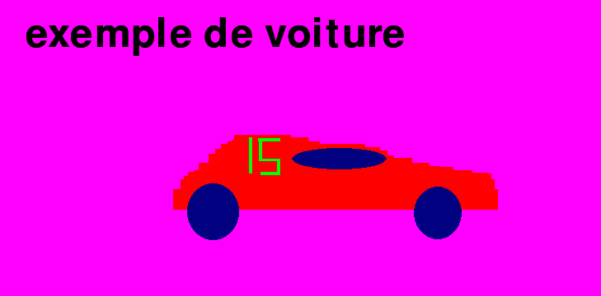

# Graphic editor

## Introduction

Un éditeur graphique permet de maninupler des objets, que ce soit des images importées, des objets dessinés, ou du text écrit. Nous pouvons ainsi dessiner des formes aux épaisseurs et aux couleurs diverses et les supprimer; importer des images, manipuler leur position et leur rotation; placer du text pré-choisi aux coordonnées voulues. 

## Description

Notre editeur graphique:

- a une fenêtre aux dimensions réglables avec la souris
- jouer de la musique en arrière plan grace au module mixer
- permet d'importer des formes (rectangles, ellipses, et lignes) 
- permet à l'utilisateur la modification de l'épaisseur et de la couleur de celles-ci 
- permet à l'utilisateur de modifier la couleur de l'arrière plan
- permet d'importer des images
- permet à l'utilisateur de faire le déplacement et la rotation de celles-ci
- permet de créer du text à des coordonnées choisies
- permet la sauvegarde de l'éditeur si elle est voulue par l'utilisateur

## Interface

## Raccourcis claviers

#### Arrière-plan
- X change la couleur de l'arrière plan en Or
- C change la couleur de l'arrière plan en Cyan
- V change la couleur de l'arrière plan en Magenta
- N change la couleur de l'arrière plan en Noir
- B change la couleur de l'arrière plan en Blanc
- M change la couleur de l'arrière plan en Marin

#### Formes
- R pour dessiner des rectangles
- E pour dessiner des ellipses
- L pour placer des points pour faire un polygone
- 1 pour une épaisseur de 1 sur la prochaine forme dessinée
- 2 pour une épaisseur de 3 sur la prochaine forme dessinée
- 7 couleur rouge 
- G couleur verte
- 8 couleur bleu

- ESC supprime la dernière forme déssinée

#### Image
- I pour importer une image (en précisant son emplacement et son extension)
- Q commence le déplacement de l'image
- Y arrête le déplacement de l'image
- H commence la rotation de l'image
- A arrête la rotation de l'image

#### Texte
- T demande le texte voulu et sa position (à écrire dans le terminal)

#### Sauvegarde 
- La sauvegarde se fait par l'écriture de "oui" ou de "non" à la fermeture du fichier

